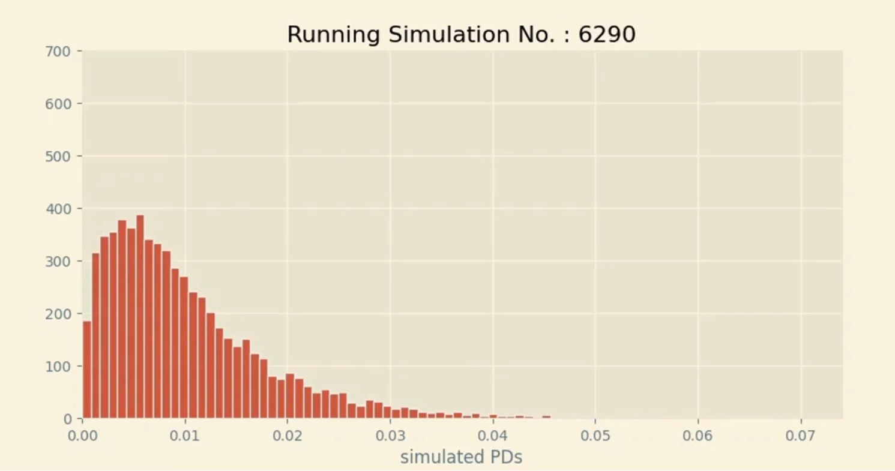

# README: Monte Carlo Simulations for PD Forecasting




## Overview

This Python script simulates the **Probability of Default (PD)** using **Monte Carlo simulations** based on **Beta distribution**. The user inputs **best, base, and worst-case PDs**, and the script calculates the most likely PD range through simulations. The Beta distribution parameters (alpha and beta) are estimated dynamically, and the simulation results are visualized using a plot.

### Key Features:
- **Monte Carlo Simulations** for PD forecasting
- **Beta distribution fitting** using user inputs for best, base, and worst-case PDs
- **Estimation of Beta distribution parameters (alpha and beta)** based on the given PD values
- **Visualization of simulation results** in a distribution plot

## Requirements

- `argparse`: For parsing command-line arguments
- `scipy.stats`: For statistical calculations (Beta distribution fitting)
- `scipy.optimize`: For optimization and solving nonlinear equations
- `monte_carlo_simulations.py`: A custom module to handle the simulation logic
- `visuals.py`: A custom module to generate the plot

## How It Works

1. **Input Parameters**: 
   - `pd_best`: Best-case PD (optimistic scenario)
   - `pd_base`: Base-case PD (most likely scenario)
   - `pd_worst`: Worst-case PD (stress scenario)
   - `guess_alpha`: Initial guess for the Beta distribution's alpha parameter
   - `guess_beta`: Initial guess for the Beta distribution's beta parameter
   - `number_of_simulations`: Number of Monte Carlo simulations to run

2. **Beta Distribution Estimation**:
   The script estimates the **alpha** and **beta** parameters of the Beta distribution using the user-provided PD values (`pd_best`, `pd_base`, `pd_worst`). The optimization process is carried out using `scipy.optimize.fsolve` to solve for the distribution parameters that fit the given PD data.

3. **Monte Carlo Simulations**:
   Once the Beta distribution parameters are estimated, the script runs the Monte Carlo simulations to generate a range of possible PD values based on the estimated Beta distribution.

4. **Visualization**:
   The results of the Monte Carlo simulations are plotted using the `plot_dist` function, which visualizes the probability distribution of PD values.

## Usage

Run the script from the command line with optional parameters:

```bash
python pd_simulation.py --pd_best 0.0023397 --pd_base 0.01013717 --pd_worst 0.0348274 --guess_alpha 2.0 --guess_beta 2.0 --number_of_simulations 10000
```

### Arguments:
- `--pd_best`: Best-case PD (default: 0.0023397)
- `--pd_base`: Base-case PD (default: 0.01013717)
- `--pd_worst`: Worst-case PD (default: 0.0348274)
- `--guess_alpha`: Initial guess for alpha parameter (default: 2.0)
- `--guess_beta`: Initial guess for beta parameter (default: 2.0)
- `--number_of_simulations`: Number of simulations to run (default: 10000)

## Example

To simulate PD forecasts with the following settings:
- Best-case PD: 0.0023397
- Base-case PD: 0.01013717
- Worst-case PD: 0.0348274
- Number of simulations: 10,000

Run:

```bash
python pd_simulation.py --pd_best 0.0023397 --pd_base 0.01013717 --pd_worst 0.0348274 --number_of_simulations 10000
```

This will estimate the Beta distribution parameters, run the simulations, and generate a plot of the resulting PD distribution.

## Functions

### `main()`
Handles argument parsing and orchestration of the simulation process.

### `find_alpha_beta(event)`
Estimates the alpha and beta parameters of the Beta distribution based on user inputs.

### `variance_est(event)`
Estimates the variance of the Beta distribution based on the difference between the best and worst PD values.

### `beta_params(x, event)`
Defines the system of equations used to calculate the alpha and beta parameters for the Beta distribution.


